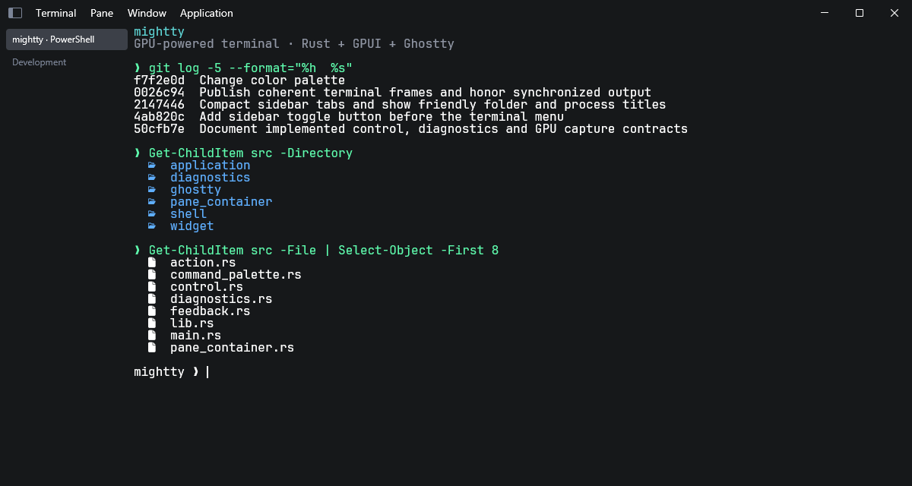
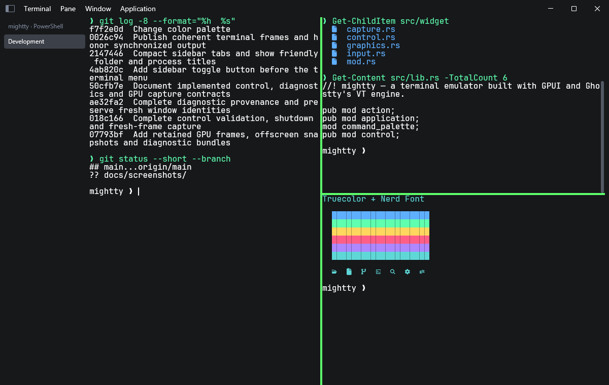
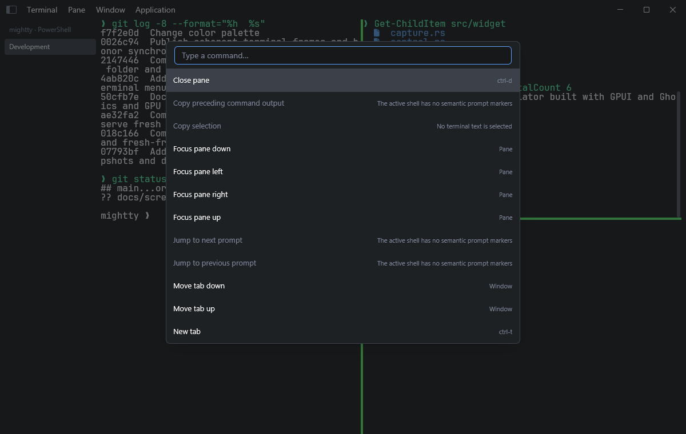

# mightty

mightty is a GPU-powered terminal emulator built with Rust, GPUI, platform
PTYs, and Ghostty's `libghostty-vt`.

mightty targets Windows first, with Windows shell I/O through ConPTY and Unix
shell I/O through a forkpty-backed bridge.

## Screenshots

PowerShell with colored output and Nerd Font icons.



Split panes with source files, Git history, and truecolor output.



The command palette over the active terminal layout.



## Features

- GPU-rendered terminal UI through GPUI.
- Terminal emulation through Ghostty's `libghostty-vt`, built directly from the
  pinned Ghostty source submodule.
- Protocol-controlled cursor appearance and synchronized output, with one owned
  presentation frame shared by rendering, IME positioning and capture.
- Scrollback, selection, mouse reporting, safe paste, hyperlinks, a scrollbar,
  and full-scrollback search.
- Typed profiles, themes, fonts, key bindings, and safe settings reload.
- Native text composition with local preedit and cursor-positioned candidates;
  search and command-palette queries use native text fields.
- One typed action model for shortcuts, native menus, and the command palette.
- Binary pane splits with divider drag, directional focus, resize, and zoom.
- Named workspace save and restore with fresh shell processes.
- Shell titles, trusted local directories, prompt navigation, and command-output
  selection through PowerShell and Bash integration.
- One Windows process with activation IPC and a persistent quick-terminal
  window.
- Signed per-user MSIX packaging, AppInstaller updates, and Windows
  default-terminal handoff support.
- Kitty graphics rendering with crop, z-order, deletion, and GPU cache reuse.
- Windows shell I/O through ConPTY and Unix shell I/O through forkpty.
- Embedded JetBrainsMono Nerd Font Mono for terminal text.
- Windows CLI control, persisted diagnostic state, waits, and event streams.
- Lossless GPU snapshots of the presented UI and offscreen tabs/panes;
  `Ctrl+Shift+F12` writes the same diagnostic bundle.

## Stack

- [GPUI](https://github.com/zed-industries/zed/tree/main/crates/gpui) for UI rendering.
- [gpui-component](https://crates.io/crates/gpui-component) for the root component wrapper.
- [Ghostty](https://github.com/ghostty-org/ghostty) for the VT engine.
- A project-owned Rust module over Ghostty's public C interface.
- Windows ConPTY and Unix forkpty for shell process integration.

## Requirements

- Rust with edition 2024 support.
- Git, used to initialize and validate the pinned Ghostty submodule.
- Zig `0.16.0`, used directly by `build.rs` to compile Ghostty's VT library.
- The initialized Ghostty source submodule at `ghostty/`.
- Four local JetBrainsMono Nerd Font Mono files under `fonts/JetBrainsMono/`:
  `JetBrainsMonoNerdFontMono-Regular.ttf`,
  `JetBrainsMonoNerdFontMono-Bold.ttf`,
  `JetBrainsMonoNerdFontMono-Italic.ttf`, and
  `JetBrainsMonoNerdFontMono-BoldItalic.ttf`. Fonts are not vendored.
- Windows 10 version 1809 or newer for ConPTY, or a Unix platform for forkpty.

This repo includes a `.mise.toml` pin for Zig:

```bash
git submodule update --init ghostty
mise install
```

The commands below use `mise exec --` so Cargo sees the pinned Zig executable.
You can instead put Zig on `PATH` or set `ZIG` to a specific executable and run
Cargo directly. Normal builds do not require Clang. Regenerating the private
Rust C bindings after a Ghostty update additionally requires `libclang`.

## Build

```bash
mise exec -- cargo build
mise exec -- cargo build --release
```

The root `build.rs` runs Zig against the local `ghostty/` submodule and links
the resulting static `libghostty-vt` archive. It never fetches a separate
Ghostty checkout and there are no `libghostty-vt` Rust crate dependencies.

Development builds use Zig `ReleaseSafe`, retaining runtime safety without
Ghostty's expensive page integrity audits. Use `cargo run --features ghostty-debug`
when investigating Ghostty core integrity. Release builds use `ReleaseFast`.

The binding generator records the Ghostty commit and public-header fingerprint
in `src/ghostty/bindings.version`. Every build verifies the submodule against
that record before compiling or linking. See
[`docs/ghostty-integration.md`](docs/ghostty-integration.md) for ownership,
safety invariants, and the update procedure.

The ordered product feature list and implementation research are in
[`docs/feature-roadmap.md`](docs/feature-roadmap.md).

## Run

```bash
mise exec -- cargo run
```

The default shell is `pwsh.exe` on Windows. Unix uses `$SHELL`, falling back to
`/bin/sh` when the variable is unset.

See [Settings](docs/settings.md) for profiles, themes, fonts, key bindings, and
safe live reload.

See [Workspaces](docs/workspaces.md) for named layout save and restore.

See [Shell integration](docs/shell-integration.md) for PowerShell and Bash
prompt markers, directory inheritance, and semantic actions.

See [Windows distribution](docs/windows-distribution.md) for signed packages,
updates, protocol activation, and default-terminal setup.

## Control and diagnostics (Windows)

Inspect a running instance, use its returned IDs, and keep `--instance ID` on
commands when more than one instance is running:

```powershell
mightty ctl instances --json
mightty ctl capabilities --json
mightty ctl state --json
mightty ctl pane split --pane p1 --direction left
mightty ctl pane resize --pane p1 --edge right --delta-px 40
mightty ctl pane read --pane p1 --tail 100
mightty ctl snapshot --window active --frame presented --out .\captures
mightty ctl snapshot --pane p1 --out .\captures
mightty ctl state --saved --instance ID --json
```

`presented` captures the retained successful frame without repainting; `next`
waits for a fresh scene. Pane/tab snapshots default to offscreen rendering and
preserve live selection and PTY size. Bundles include PNG pixels, matching
source/frame metadata, current state, environment, and bounded diagnostics.

For disposable automation, start `mightty --test-instance --data-dir PATH`.
This uses isolated settings/storage and disables global hotkeys and COM
registration. See the [control and diagnostics contract](docs/control-and-diagnostics-design.md)
for targeting, input, waits, persistence, and capture limits. The
[local GPUI patch](vendor/gpui/MIGHTTY-PATCH.md) supplies native input dispatch
and Direct3D readback; optional resolved glyph/face diagnostics are unavailable.

## Shell I/O

Terminal I/O is wake-driven. `TerminalWidget` owns a `PtyWorker`; the platform
shell modules own the raw PTY handles.

`LaunchSpec` keeps the executable, arguments, working directory, and environment
separate. Both platform shell modules use these values without a shell command
string.

On Windows, `PtyParts::spawn` creates split ConPTY handles:

- `PtyInput::write_all(&[u8])` sends command input and terminal responses.
- `PtyOutput::read(&mut [u8])` blocks in `ReadFile` and returns `Data(usize)` or `Eof`.
- `PtyControl::resize(PtySize)` resizes the pseudoconsole.
- `PtyControl::shutdown()` closes the pseudoconsole and cleans up the child process.

The worker uses one command/control thread and one blocking output reader
thread. Output events wake a retained GPUI foreground task, which applies data
to the local Ghostty terminal module, drains ready chunks up to a fixed budget,
and then notifies the UI. Both platform backends expose blocking reads as
`PtyRead::Data(usize)` or `PtyRead::Eof`.

## Development

Useful checks:

```bash
mise exec -- cargo fmt --all -- --check
mise exec -- cargo check
mise exec -- cargo clippy --all-targets -- -D warnings
mise exec -- cargo test
# Disposable Windows GUI checks, after cargo build:
pwsh -NoProfile -File tools/control-smoke.ps1
pwsh -NoProfile -File tools/control-smoke.ps1 -SnapshotOnly
mise exec -- cargo run --example capture_fidelity
```

After changing the Ghostty submodule revision or public C headers, regenerate
the private bindings. This command requires `libclang`:

```bash
mise exec -- cargo run --manifest-path tools/ghostty-bindings/Cargo.toml
```

Useful runtime shortcuts:

- `Ctrl+T` (`Cmd+T` on macOS): open a new tab, up to nine tabs.
- `Ctrl+B` or the panel button before **Terminal**: hide or show the tab sidebar. The button's panel is filled while the sidebar is visible.
- `Ctrl+1` through `Ctrl+9`: switch to an existing tab.
- Sidebar tabs use compact rows without numbers. Default titles show the folder and process, such as `mightty · pwsh`; custom shell titles are preserved, and hovering shows the full label.
- `Alt+Enter`: split the active pane to the right.
- `Alt+Shift+Enter`: split the active pane downward.
- `Ctrl+D`: close the active pane, or close the active tab when it has one pane.
- `Ctrl+Shift+C` (`Cmd+C` on macOS): copy the active terminal selection.
- `Ctrl+Shift+V` (`Cmd+V` on macOS): paste with unsafe-paste confirmation.
- `Ctrl+Shift+F` (`Cmd+F` on macOS): search the full terminal scrollback.
- `Ctrl+Shift+P` (`Cmd+Shift+P` on macOS): open the command palette.
- `Cmd+Q` on macOS: quit.
- `Ctrl+Shift+F12`: write a presented-frame diagnostic bundle to `captures/` on Windows.

Drag with the left mouse button to select text. Double-click selects a word and
triple-click selects a line using Ghostty's selection rules. Hold `Ctrl+Alt`
while dragging for rectangular selection (`Option` on macOS).

Split dividers are draggable. The command palette provides directional focus,
pane resize, and pane zoom actions.

## Project Layout

```text
src/
├── main.rs              # App entry point and window lifecycle
├── lib.rs               # Library module exports
├── action.rs            # Typed actions, descriptors, bindings, and menus
├── command_palette.rs   # Palette filtering and action entries
├── control.rs           # CLI, protocol, schemas, and bounded transport
├── diagnostics.rs       # State persistence, process sampling, and logs
├── snapshot.rs          # GPU frame acquisition and diagnostic bundles
├── ui_control.rs        # Normal GPUI keyboard, pointer, and text injection
├── feedback.rs          # Serializable terminal/frame capture data
├── pane_container.rs    # Tabs, sidebar, workspaces, and action dispatch
├── profile.rs           # Stable profile IDs and shell launch values
├── settings.rs          # Typed settings, discovery, and safe reload
├── shell_integration.rs # Trusted shell metadata and integration setup
├── split.rs             # Binary split tree and pane geometry
├── workspace.rs         # Serializable workspace layouts
├── application/
│   ├── activation.rs    # Typed process activation requests
│   └── windows/         # Hotkey, IPC, quick terminal, and COM handoff
├── widget/
│   ├── mod.rs           # Terminal widget lifecycle and GPUI task wiring
│   ├── pty.rs           # Wake-driven PTY worker bridge
│   ├── input.rs         # GPUI key event to Ghostty key encoding
│   ├── presentation.rs  # Owned frame builder and synchronized publication
│   ├── render.rs        # Terminal cell rendering
│   ├── native_presentation.rs # Explicit Windows GPU regression (tests only)
│   ├── graphics.rs      # Kitty graphics resource cache and placement
│   ├── search.rs        # Search result projection and overlay state
│   └── capture.rs       # Terminal-state feedback snapshot
├── ghostty/
│   ├── mod.rs           # Public local Ghostty interface
│   ├── terminal.rs      # Terminal ownership and PTY callback
│   ├── selection.rs     # Ghostty selection gesture state and event bridge
│   ├── render.rs        # Snapshot and lending render iterators
│   ├── graphics.rs      # Lending Kitty graphics wrappers
│   ├── search.rs        # Incremental full-scrollback search
│   ├── diagnostics.rs   # Non-consuming bounded terminal observations
│   ├── semantic.rs      # Shell metadata and semantic regions
│   ├── mouse.rs         # Mouse mode and event encoding
│   ├── paste.rs         # Paste safety and bracketed encoding
│   ├── key.rs           # Key event and encoder ownership
│   ├── style.rs         # Renderer-facing colors and styles
│   ├── error.rs         # C result conversion
│   ├── abi.rs           # Target-native Rust/Zig layout audit
│   ├── bindings.version # Expected Ghostty revision/header fingerprint
│   └── ffi.rs           # Generated private C bindings
└── shell/
    ├── mod.rs           # Platform shell bridge exports
    ├── windows.rs       # Windows ConPTY implementation
    └── unix.rs          # Unix forkpty implementation
tools/
├── ghostty-bindings/    # Reproducible binding generator
└── *.ps1                # Windows package, proxy, and upgrade tools
packaging/windows/       # MSIX, AppInstaller, and COM proxy inputs
shell-integration/       # PowerShell and Bash integration resources
```

## License

Project code is MIT-licensed. Adapted code and third-party attribution are
recorded in [`THIRD_PARTY_NOTICES.md`](THIRD_PARTY_NOTICES.md).
